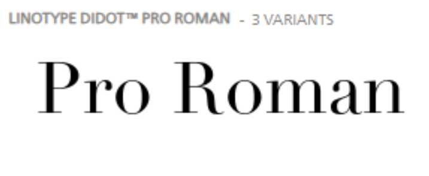
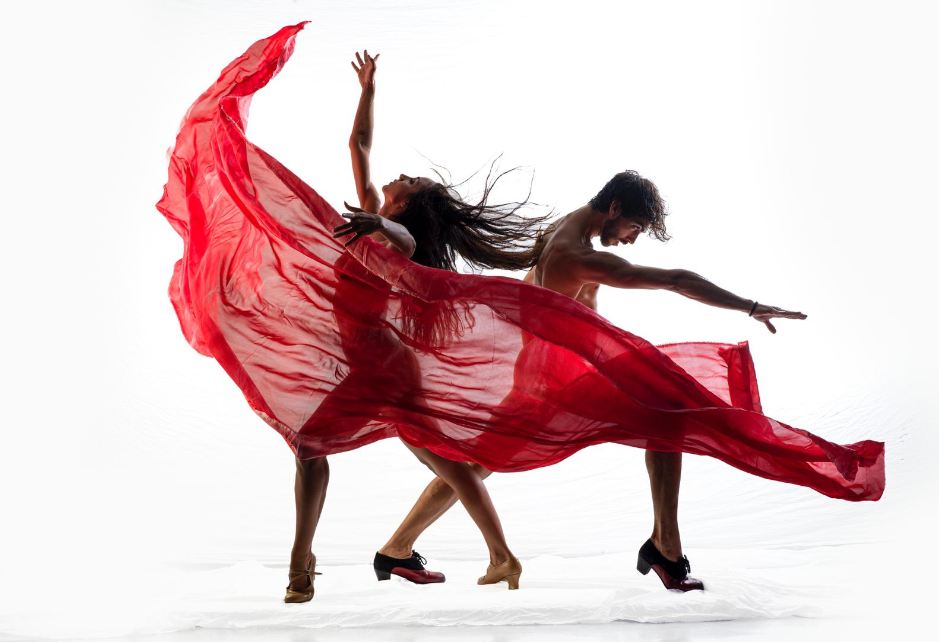
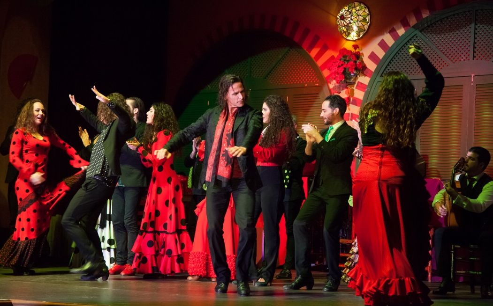

# DIU - Practica 3, entregables

## Moodboard (diseño visual + logotipo)   

LOGOTIPO

Para el logotipo vamos a usar el mismo que se usa en la página oficial de La Alboreá, que es el siguiente: 

-----

Hemos decidido mantener el logo porque el color (rojo) y las formas que dibuja (especie de flores…) , en nuestra opinión, representa bastante bien el flamenco y la web a la que está dirigida.

PALETA DE COLORES

-----

Nuestra elección de colores se ha centrado en tonos rojizos, blancos y oscuros con el propósito de dotar a nuestra página de una estética más elegante. Para lograr este efecto, hemos optado por utilizar colores que generan un contraste visual atractivo, como el blanco en combinación con los tonos oscuros. El rojo ha sido seleccionado debido a su reconocida asociación con el flamenco, siendo considerado el color por excelencia que representa esta expresión artística.

FUENTES A USAR

Hemos elegido estas dos fuentes gracias a su simplicidad y a que no tiene un adorno cargado. “Inter” queda mejor en el menú de navegación y en títulos, mientras que Actor ha sido elegida para el cuerpo de los textos.

Actor

-----

Inter

-----

Linotype Didot
La fuente del logo es: LinoType Didot. La hemos usado en la “Landing Page” debido a que su estilo para la frase motivadora es bastante atractivo.

-----

ICONOS SÍMBOLOS A USAR Y SU ESTILO

El uso del logo, como hemos comentado anteriormente, está presente en todas las páginas de nuestra web, ya que representa con exactitud nuestro espectáculo.

-----

En la web realizada hemos usado iconos para representar cada una de las redes sociales.
Youtube, Twitter, Instagram, Google (para búsqueda).

-----

Hemos hecho que al hacer click sobre cada uno, lleve al usuario a la respectiva web de LaAlborea.

También hemos usado las banderas de países como España, Italia, Japón, Francia e Inglaterra.

-----

En la compra de entradas hemos insertados símbolos como:

-----

IMAGENES INSPIRADORES

La siguiente imagen es bastante representativa para el color Rojo de nuestra paleta de colores.

-----

La siguiente foto también está representando los colores de nuestra paleta. En concreto el blanco que le da contraste y una pizca de elegancia.

-----

Seguimos representando los colores de la paleta, además de la idea del “Tablao”.

-----

## Landing Page

## Mockup: LAYOUT HI-FI

## Documentación: Publicación del Case Study

(incluye) Valoración del equipo sobre la realización de esta práctica o los problemas surgidos
 
