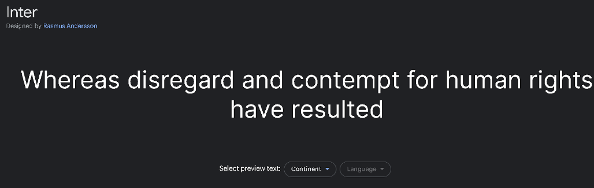

# DIU - Practica 3, entregables

## Moodboard (diseño visual + logotipo)   

LOGOTIPO

Para el logotipo vamos a usar el mismo que se usa en la página oficial de La Alboreá, que es el siguiente: 

-----

Hemos decidido mantener el logo porque el color (rojo) y las formas que dibuja (especie de flores…) , en nuestra opinión, representa bastante bien el flamenco y la web a la que está dirigida.

PALETA DE COLORES

-----

Nuestra elección de colores se ha centrado en tonos rojizos, blancos y oscuros con el propósito de dotar a nuestra página de una estética más elegante. Para lograr este efecto, hemos optado por utilizar colores que generan un contraste visual atractivo, como el blanco en combinación con los tonos oscuros. El rojo ha sido seleccionado debido a su reconocida asociación con el flamenco, siendo considerado el color por excelencia que representa esta expresión artística.

FUENTES A USAR

Hemos elegido estas dos fuentes gracias a su simplicidad y a que no tiene un adorno cargado. “Inter” queda mejor en el menú de navegación y en títulos, mientras que Actor ha sido elegida para el cuerpo de los textos.

Actor

-----

Inter

-----

Linotype Didot
La fuente del logo es: LinoType Didot. La hemos usado en la “Landing Page” debido a que su estilo para la frase motivadora es bastante atractivo.

-----

ICONOS SÍMBOLOS A USAR Y SU ESTILO

El uso del logo, como hemos comentado anteriormente, está presente en todas las páginas de nuestra web, ya que representa con exactitud nuestro espectáculo.

-----

En la web realizada hemos usado iconos para representar cada una de las redes sociales.
Youtube, Twitter, Instagram, Google (para búsqueda).

-----

Hemos hecho que al hacer click sobre cada uno, lleve al usuario a la respectiva web de LaAlborea.

También hemos usado las banderas de países como España, Italia, Japón, Francia e Inglaterra.

-----

En la compra de entradas hemos insertados símbolos como:

-----

IMAGENES INSPIRADORES

La siguiente imagen es bastante representativa para el color Rojo de nuestra paleta de colores.

-----

La siguiente foto también está representando los colores de nuestra paleta. En concreto el blanco que le da contraste y una pizca de elegancia.

-----

Seguimos representando los colores de la paleta, además de la idea del “Tablao”.

-----

## Landing Page

Al realizar un rediseño de la web “https://alboreaflamenco.com/”, hemos realizado una landing page acorde al tema principal y necesidades de la web.

Nuestra landing page la hemos realizado de la siguiente manera:
Hemos respetado la paleta de colores que tenemos en el MoodBoard, pero hemos hecho hincapié en los colores rojo y negro. Estos colores tienen una combinación excelente, proporcionando tanto contraste como elegancia. El logo también está presente.

Hemos usado también circunferencias de color rojo para adornar la web. Estas intentan hacer referencia a los vestidos gitanos tradicionales.
También se ha incluido una foto representativa y fuerte de una bailaora en plena actuación.

Para ir finalizando, hemos incluido una frase motivadora que incite a las personas a conocer más sobre el espectáculo del flamenco y no se quede en un simple vistazo a la página de promoción

Además, se ha intentado que la información sea lo más escueta posible para no abrumar al usuario. Intentando suministrar a la persona, que visualice esta web de promoción, los “feelings” necesarios para que le interese ver la web de LaAlborea.

Como último recurso se ha añadido un botón “Página Principal”, que nos lleva a la página oficial de LaAlborea. En rojo, bien resaltado, incitando al usuario a pinchar en él.

ScreenShot:

-----

## Mockup: LAYOUT HI-FI

LAYOUT HI-FI

https://www.figma.com/file/9LnKx1VvkiZ5mQpKYSclre/Pagina-Interactiva-%5BTheBoys12%5D----La-Alborea?type=design&node-id=0%3A1&t=AGIWAY5YC4FIpg43-1

Página de Inicio:

-----

Página Información:

-----

Página de Compra de Entradas:

-----

## Guidelines:

Para el diseño de nuestra web hemos realizado una página interactiva en Figma fijándonos y mejorando el boceto realizado en la práctica anterior.

En la página principal y de información los hemos estructurado de la siguiente forma:
Header: Posee el logo, menú de navegación, compra de entradas.
Main Content: Galería de fotografías más interesantes del espectáculo. Además hay información y videos sobre este. También hemos colocado la ubicación del tablao.
Footer: Pie de página con las redes sociales, información sobre esta, logo y contacto.

La página para la compra es diferente. Posee opciones para personalizar la entrada. Al final se da una especie de resumen de ésta. (Al final está el footer)

Elementos en común: 
Vertical DropDown. 	Elección de participantes en la compra de entradas.
Horizontal DropDown. Cambio de Idioma
Gallery. Muestra las fotos en la página de Inicio del espectáculo, o la página de información, de los artistas.

Tras realizar por completo el diseño de las páginas más importantes Landing Page, Inicio, Información y compra entradas, hemos realizado uso de interacciones entre los elementos del diseño establecido para que haya cierta navegación.
Hemos usado interacciones “on click” para movernos entre las diferentes páginas.
Además, hemos insertado botones desplegables, cambio de idioma, para la elección de participantes, tipos de espectáculos, etc…

Estos desplegables se han realizado mediante la creación de componentes. El asset final (en este caso desplegables) se pasan al diseño y cumplen con las características establecidas.

## Documentación: Publicación del Case Study
La práctica ha sido la más interesante de realizar de cara a la mejora de la web LaAlborea. Hemos tenido que mejorar la estructura con respecto al boceto realizado en la practica 2, ya que 
poseía diferentes puntos negativos los cuales debíamos de mejorar, como la compra de entradas, el menu de navegación, header, etc...

Los problemas que hemos encontrado y nos ha costado más, ha sido la animación de los desplegables y la selección de tipos de entrada en la pagina de Compra.

Por lo general, creemos que hemos realizado un buena aproximación del diseño de la web, y hemos abordado con éxito los problemas mencionados de la práctica anterior.
 
